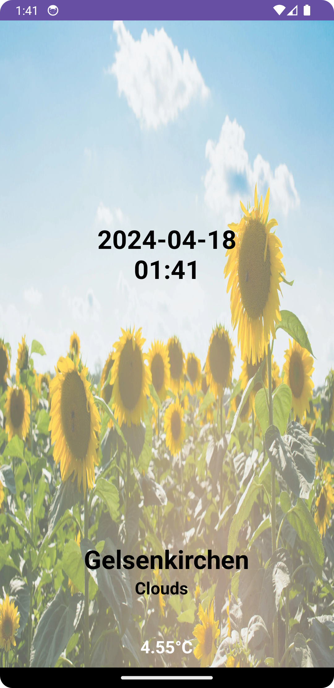

# MyProject

MyProject is a simple Android application that retrieves weather information using the OpenWeatherMap API.

## Installation

To install and run MyProject on your local machine, follow these steps:

1. Clone the repository: `git clone https://github.com/jayIsThere/TimeWeatherWidget/`
2. Open the project in Android Studio.
3. Build and run the project on your device or emulator.

## Usage

After launching the application, you can click the refresh button to fetch the latest weather information for Gelsenkirchen. The app displays the current date, city name, weather description, and temperature.

## Screenshots

## Contributing

Contributions are welcome! Please fork the repository and submit a pull request with your changes.

